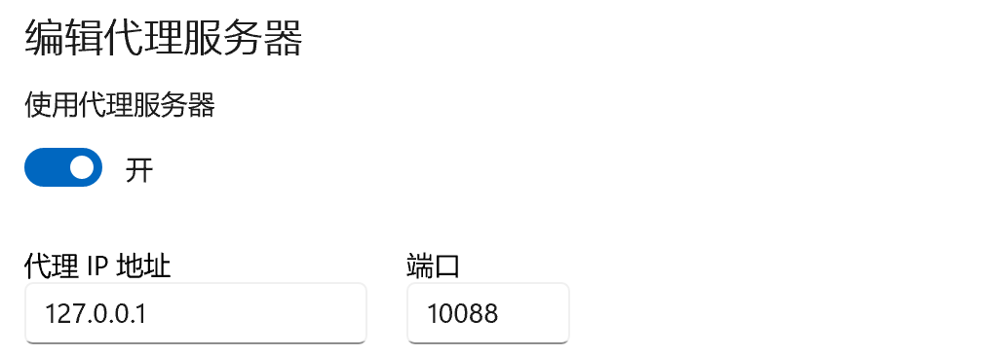

# 简单HTTP代理服务器的Java实现

## 简介

本项目实现一个简单的HTTP代理服务器。

* 支持HTTP/1.0以及HTTP1.1协议
* 支持HTTP GET以及HTTP POST请求
* 支持If-modified-since首部行的条件GET请求
* 可以对GET请求得到的响应进行缓存
* 支持网站过滤、用户过滤、网站钓鱼等设置

---

## 使用说明

==使用之前，请确保在`127.0.0.1`的`10088`端口开启代理服务器设置！==




主程序位于`src/main/java/com/crows/ProxyServer.java`：

```java
    public static void main(String[] args)
    {
        try (ServerSocket serverSocket = new ServerSocket(PORT); Scanner s = new Scanner(System.in)) {
            System.out.println("请输入用户名");
            // 登录用户名
            String user = s.nextLine().trim();
            System.out.println("Proxy server started on port " + PORT);

            // 无限循环，等待客户端连接
            while (true) {
                Socket clientSocket = serverSocket.accept();
                clientSocket.setSoTimeout(10000); // 设置超时时间为10秒
//                new Thread(new AdvancedProxy(clientSocket, user)).start();
                executor.submit(new AdvancedProxy(clientSocket, user));
            }
        } catch (IOException ignored) {}
    }
```

使用线程池为HTTP报文创建Proxy类进行处理。可以选择`SimpleProxy`、`CacheProxy` 和`AdvancedProxy`三种实现类。建议使用**AdvancedProxy**，因为只有它支持上面的所有功能。

根据系统提示输入用户名即可开启代理服务器。

---

配置文件位于`src/main/resources/config.xml`中：

```xml
<?xml version="1.0" encoding="UTF-8"?>
<configuration>
    <websites>
        <website>today.hit.edu.cn</website>
        <website>httpbin.org</website>
        <website>example.com</website>
    </websites>
    <users>
        <user>Crows</user>
        <user>Admin</user>
    </users>
    <fishes>
        <fish>example.com</fish>
    </fishes>
</configuration>
```

在上面可以配置允许访问的网站和用户。也可以配置钓鱼网站：当访问该网站时将自动跳转至[今日哈工大](today.hit.edu.cn)。

---

缓存文件夹`src/main/resources/Cache`中存储着服务器响应的缓存文件，均为`.txt`类型，可以直接查看。

与其相邻的`fish.txt`文件则存储着钓鱼时默认发送的报文：

```
HTTP/1.1 302 Found
Location: http://today.hit.edu.cn/
Content-Length: 0

```

即通过重定向响应实现钓鱼功能。
若想更改钓鱼目标网站，可以在Location项修改，但不要忘记在`config.xml`中添加该网站以允许访问。

---